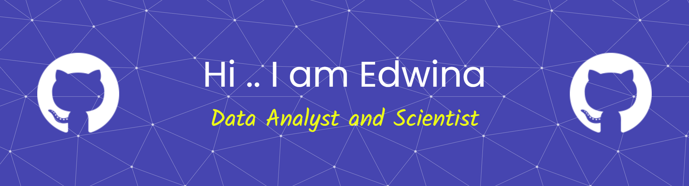

  

<!--
**edwinaabam/edwinaabam** is a ✨ _special_ ✨ repository because its `README.md` (this file) appears on your GitHub profile.

Here are some ideas to get you started:

- 🔭 I’m currently working on ...
- 🌱 I’m currently learning ...
- 👯 I’m looking to collaborate on ...
- 🤔 I’m looking for help with ...
- 💬 Ask me about ...
- 📫 How to reach me: ...
- 😄 Pronouns: ...
- ⚡ Fun fact: ...
-->

I’m a data-focused problem solver with a strong interest in applied data science and machine learning, particularly projects that move beyond analysis into real, usable systems.

I enjoy working across the full journey of a project — from understanding data and exploring patterns, through modelling and evaluation, to building simple interfaces that allow others to interact with the results.

---

## 🌱 What I’m currently working on

- End-to-end data science and machine learning projects  
- Turning trained models into usable applications (inference, APIs, simple UIs)  
- Strengthening my understanding of how models are used in practice, not just built  

---

## 📂 Featured Project

### 🥖 Perishable Goods Demand & Waste Prediction  
**Tools:** Python, Pandas, Scikit-learn, FastAPI, Streamlit  

An end-to-end project focused on predicting unit sales for perishable retail goods. The project includes:
- exploratory data analysis and feature preparation  
- training and saving predictive models  
- a FastAPI backend for model inference  
- a Streamlit interface for user interaction  

👉 [View the repository](https://github.com/edwinaabam/FrostUK)

---

## 🛠️ Languages & Tools

  
  
  
  
  
  
  
  

  
  

---

## 🌐 Find me elsewhere

- 🌍 Website: https://edwinaabam.github.io  
- 💼 GitHub: https://github.com/edwinaabam  

---

Thanks for stopping by — feel free to explore the projects or check back as I continue building and learning.
